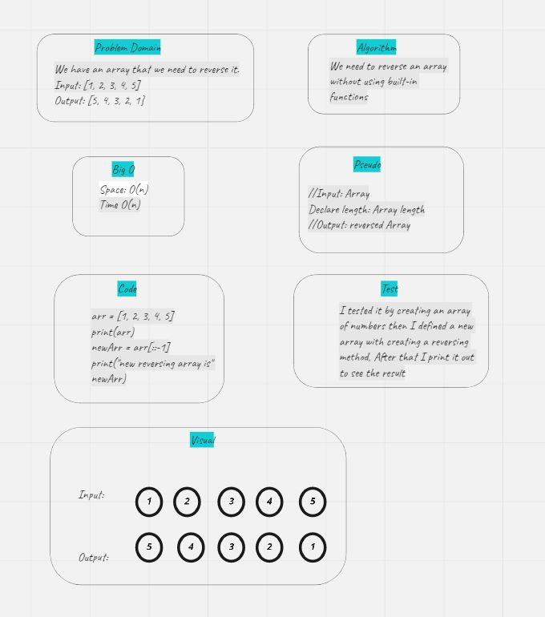

# reverse an array:
- - The challenge asked me to revers a list using python but without using built-in functions.

- 

# Approach & Efficiency:
- - I used a simple method called slice notation to reverse the list.