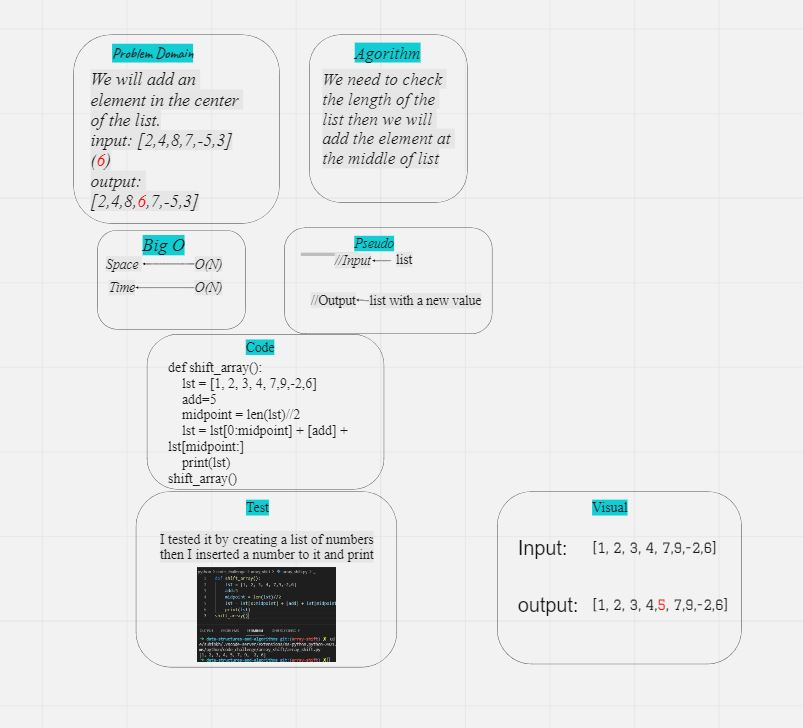

# shift array:
- The challege asked me to add a value in the middle of the list using python withot using any built-in functions.

# Whiteboard Process:
 

 # Approach & Efficiency:
 - I created a function then inside of it I put the list,
 after that I divided the list by 2 and used slice notation method.
